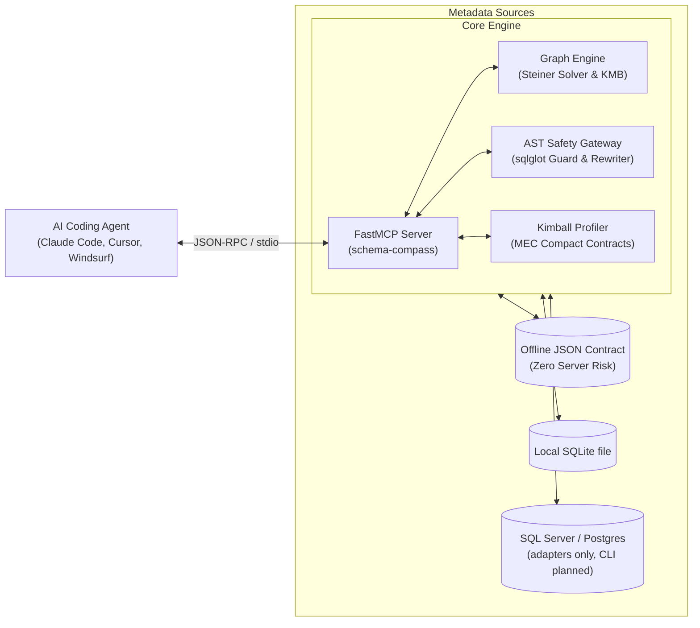

# schema-compass

An open-source Model Context Protocol (MCP) server that gives AI coding agents (Claude Code, Cursor, Windsurf, Antigravity) a compact map of a relational schema, computes join paths between tables, and validates SQL through an AST-based read-only guard.

**Status (v0.1, beta):** schema sources today are SQLite and offline JSON exports. SQL Server and PostgreSQL metadata adapters exist but are not wired into the CLI yet (see [Roadmap](#roadmap)). `execute_safe_query` validates and rewrites SQL; it does not run it against a database.

[](https://github.com/adulsaa-q/schema-compass/actions/workflows/ci.yml)
[](LICENSE)
[](https://www.python.org/)
[](https://modelcontextprotocol.io/)

---

## Why Schema-Compass Exists

### 1. Schema Overload
A schema with hundreds of tables does not fit comfortably in a model's context, and sending it with every question is slow and expensive. In one test, the DDL of a 976-table database was about 165,000 tokens (see [Benchmarks](#benchmarks)).

Schema-Compass implements **Minimal Effective Context (MEC)**:
- Instead of dumping raw DDLs, the agent searches the catalog and asks for compact contracts of only the tables it needs.
- Contracts include column types, keys, and inlined foreign key relationships (null rates and sample values are rendered when present, but the current extractors do not fill them yet) (e.g. `- customer_id: INT (FK -> customers.customer_id)`).

### 2. Wrong Joins and Cartesian Products
When a schema lacks foreign keys or relies on naming conventions, an agent can guess join keys wrong or write an accidental Cartesian product. In the agent test below the model joined the Chinook tables correctly either way, so this is a safeguard I have not seen fail on that schema.

Schema-Compass models your relational schema as an edge-weighted graph:
- Computes multi-table join paths using the **Kou-Markowsky-Berman (KMB) Minimum Steiner Tree 2-approximation algorithm**.
- Applies **Kimball dimensional heuristics** to select the natural Fact table as the query root, generating exact `FROM fact ... JOIN dim ... ON ...` SQL sequences in under 4ms.

### 3. Enterprise Database Privacy (Zero Production Server Risk)
Many data teams cannot connect AI agents directly to corporate production servers due to security policies, network firewalls, and data privacy regulations.

Schema-Compass features **Offline Schema Mode**:
- Extract table names, column types, and constraints once into an offline JSON contract.
- Only metadata (table names, column types, keys) is extracted. No row data is read.
- AI agents run completely offline against the local JSON metadata file. No network connection to your live server is needed.

### 4. Deterministic AST Safety Gateway
Regex filters fail against obfuscated SQL and subquery attacks. Schema-Compass parses every query using `sqlglot` Abstract Syntax Tree (AST) validation:
- **Strict Read-Only Enforcement:** Blocks all DDL/DML operations (`INSERT`, `UPDATE`, `DELETE`, `DROP`, `ALTER`, `TRUNCATE`, `MERGE`, `EXECUTE`).
- **Function Allowlist:** Unknown functions are rejected rather than checked against a list of known-bad names, so `pg_ls_dir`, `lo_import`, `zeroblob`, `xp_cmdshell`, `OPENROWSET` and the like are blocked by default. Add your own with `--allow-function NAME`.
- **System Catalog and Lock Protection:** Blocks reads of `sys.*`, `pg_catalog`, `sqlite_master` and similar, lock-taking table hints (`TABLOCKX`, `UPDLOCK`), recursive CTEs and `MAXRECURSION 0`. See [SECURITY.md](SECURITY.md) for the opt-outs and the known limits.
- **Cartesian Join Detection:** Flags unconstrained comma joins and cross joins even when disguised behind subqueries or trivial `WHERE 1 = 1` clauses.
- **Non-Breaking Table Hints:** Injects `WITH (NOLOCK)` on physical SQL Server tables while automatically filtering out Table-Valued Functions (`STRING_SPLIT`, `OPENJSON`) and table variables (`@var`).
- **Deterministic Row Limits:** Enforces positive row limits (`TOP 100` / `LIMIT 100`) while preserving smaller user limits (`TOP (5)` or `FETCH NEXT 5 ROWS`).

---

## System Architecture



---

## MCP Tools Reference

| Tool Name | Parameters | Output | Description |
| :--- | :--- | :--- | :--- |
| `search_catalog` | `query: str`, `top_k: int = 5` | Markdown List | Search tables, views, and columns using lexical match heuristics. |
| `get_join_tree` | `tables: list[str]` | SQL Code Block | Solves Minimum Steiner Join Tree and outputs exact `FROM ... JOIN ... ON` syntax. |
| `get_table_contract` | `table_name: str`, `mode: str = 'compact'` | MEC Markdown | Returns compact column types, keys, sample values, and inlined FK references. |
| `explain_metric` | `metric_name: str` | Lineage Summary | Provides business definitions, formulas, and upstream table/column lineage. |
| `get_schema_diagram` | `tables: list[str] \| None` | Mermaid ERD | Generates an entity-relationship diagram for the requested tables or the whole schema. |
| `execute_safe_query` | `sql: str`, `dialect: str = 'tsql'`, `max_rows: int = 100` | Rewritten SQL | Validates the query through the AST guard, injects hints, clamps row limits, and returns the safe SQL. Does not execute it. |

---

## Quickstart

### Prerequisites
- Python 3.12 or newer
- [uv](https://docs.astral.sh/uv/) (recommended package manager)

```bash
# Clone the repository
git clone https://github.com/adulsaa-q/schema-compass.git
cd schema-compass

# Install dependencies with uv
uv sync

# Run the test suite
uv run pytest

# Start the server on the bundled example schema (no database needed)
uv run schema-compass --source json --path examples/sample_schema.json
```

---

## Usage Modes

### Mode 1: Offline Schema Metadata (Zero-Risk Enterprise)
Export catalog metadata to an offline JSON file. You can commit this file to your repository or keep it on your workstation:

```bash
# Export metadata from a SQLite database
uv run python -m schema_compass.export --db sqlite --path mydb.sqlite --output my_schema.json

# Run MCP server using the offline JSON contract
uv run schema-compass --source json --path my_schema.json
```

A ready-made example lives in [`examples/sample_schema.json`](examples/sample_schema.json).

### Mode 2: Local SQLite Database
Point Schema-Compass directly to a local database file:

```bash
uv run schema-compass --source sqlite --path mydb.sqlite
```

SQL Server and PostgreSQL are not available as `--source` yet; see the [Roadmap](#roadmap).

---

## MCP Client Configuration

### 1. Claude Code CLI
Add Schema-Compass to Claude Code with a single command:

```bash
claude mcp add schema-compass -- uv --directory /absolute/path/to/schema-compass run schema-compass --source json --path /absolute/path/to/schema-compass/examples/sample_schema.json
```

### 2. Claude Desktop (`claude_desktop_config.json`)

```json
{
  "mcpServers": {
    "schema-compass": {
      "command": "uv",
      "args": [
        "--directory",
        "D:\\dev\\PSN-Q\\schema-compass",
        "run",
        "schema-compass",
        "--source",
        "json",
        "--path",
        "D:\\dev\\PSN-Q\\schema-compass\\chinook_schema.json"
      ]
    }
  }
}
```

### 3. Cursor (`.cursor/mcp.json`)

```json
{
  "mcpServers": {
    "schema-compass": {
      "command": "uv",
      "args": [
        "--directory",
        "D:\\dev\\PSN-Q\\schema-compass",
        "run",
        "schema-compass",
        "--source",
        "json",
        "--path",
        "D:\\dev\\PSN-Q\\schema-compass\\chinook_schema.json"
      ]
    }
  }
}
```

### 4. Windsurf (`~/.codeium/windsurf/mcp_config.json`)

```json
{
  "mcpServers": {
    "schema-compass": {
      "command": "uv",
      "args": [
        "--directory",
        "D:\\dev\\PSN-Q\\schema-compass",
        "run",
        "schema-compass",
        "--source",
        "json",
        "--path",
        "D:\\dev\\PSN-Q\\schema-compass\\chinook_schema.json"
      ]
    }
  }
}
```

---

## Benchmarks

```bash
uv run python evals/eval_chinook_showcase.py
uv run python evals/eval_join_benchmark.py
```

`eval_chinook_showcase.py` builds an 11-table schema modelled on the Chinook sample database (the DDL is inlined in the script, no data) and measures a 5-hop join. On one Windows dev machine:

| Metric | Result |
| :--- | :--- |
| Metadata extraction (11 tables) | ~1.3 ms |
| 5-hop join tree | ~3.2 ms |
| Prompt size, raw DDL vs. compact contract | 511 vs. 62 tokens (-87.9%) |

Token counts here use a `len / 4` estimate, not a real tokenizer. That estimate runs low for SQL: it gave about 75,000 tokens for the 976-table DDL below, and the model billed about 165,000. Treat these numbers as an illustration.

### With an agent

`evals/eval_agent_sql.py` asks Claude Code (Sonnet) to write SQL for six questions on the Chinook database, runs each answer read-only, and compares it with a reference query. One setup gives the agent only the schema-compass tools. The other puts the full DDL in the prompt. One of the six questions is a trap where joining invoices to invoice lines double-counts the invoice totals.

| Schema | Setup | Correct | Tokens per question | Cost per question |
| :--- | :--- | :--- | :--- | :--- |
| 11 tables (Chinook) | schema-compass | 6/6 | about 15,700 | $0.014 |
| 11 tables (Chinook) | full DDL | 6/6 | about 5,800 | $0.014 |
| 976 tables | schema-compass | 6/6 | about 15,700 | $0.013 |
| 976 tables | full DDL | 1/1 | 164,841 | $0.65 |

What this shows:

- On a small schema there is no gain. The whole DDL is about 5,800 tokens, so the model just reads it, and the cost is the same.
- With schema-compass the cost did not grow with the schema, because the agent only reads the tables it asks about. The full DDL of 976 tables took 165,000 tokens, close to a 200,000 token window.
- Accuracy was the same in every run I made. The benefit is cost and room in the context window, not better SQL.

What it does not show:

- The extra 965 tables are synthetic: random names, columns and keys, empty, plus five look-alikes such as `invoice_archive_2015` (`evals/make_large_schema.py`). A real warehouse is messier.
- The full-DDL setup ran on one question at the large size because it costs $0.65 each.
- One model, one run per question. A rerun can differ.
- With prompt caching, repeat questions on a full DDL cost much less after the first. The DDL still takes up the context window. I did not measure that case.

```bash
BENCH_DB=Chinook_Sqlite.sqlite uv run python evals/eval_agent_sql.py all A_mcp,B_ddl
uv run python evals/make_large_schema.py Chinook_Sqlite.sqlite large.sqlite
```

Every run is billed to your API key. `Chinook_Sqlite.sqlite` comes from the [chinook-database](https://github.com/lerocha/chinook-database) releases.

---

## Testing

```bash
uv run pytest        # runs in a few seconds
uv run ruff check .
uv run mypy src
```

The suite covers unit logic, graph edge cases, and adversarial SQL: multi-statement bypasses, subquery mutations, out-of-band exfiltration functions (`OPENROWSET`, `xp_cmdshell`), cartesian-join evasion, and cyclic topologies. See [SECURITY.md](SECURITY.md) for the threat model and how to report a bypass.

---

## Roadmap

- Wire the SQL Server and PostgreSQL metadata adapters (already in `src/schema_compass/dialects/`) into the CLI as `--source mssql|postgres`
- DuckDB as a schema source
- Populate column sample values and null rates during extraction
- Optional query execution behind the AST guard

---

## License

MIT License. Copyright (c) 2026 Adul Sa-a (Q).
